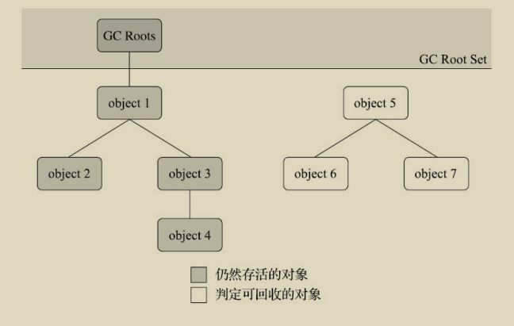

## 对象死亡判断
### 引用计数法

> -XX:+UseSerialGC -Xms200M -Xmx200M -Xmn32m -XX:SurvivorRatio=8 -XX:+PrintGCDetails
>
> 说明: 
>
> 1. Tenured 老年代被回收  **7252K->616K**
> 2. Perm 永久代没变化
>
> 结论: 
>
> 	jvm 内部不是用引用计数法来判断对象是否死亡

```java
/**
 * -XX:+UseSerialGC -Xms200M -Xmx200M -Xmn32m -XX:SurvivorRatio=8 -XX:+PrintGCDetails
 */
public class ReferenceCountingGC {
    public Object instance = null;
    private static final int _1MB = 1024 * 1024;
    /**
     * 这个成员属性的唯一意义就是占点内存，以便能在GC日志中看清楚是否有回收过
     */
    private byte[] bigSize = new byte[2 * _1MB];

    public static void testGC() {
        ReferenceCountingGC objA = new ReferenceCountingGC();
        ReferenceCountingGC objB = new ReferenceCountingGC();
        objA.instance = objB;
        objB.instance = objA;
        objA = null;
        objB = null;        // 假设在这行发生GC，objA和objB是否能被回收？
        System.gc();
    }

    public static void main(String[] args) {
        testGC();
    }
}
//[Full GC
// [Tenured: 0K->616K(172032K), 0.0036095 secs] 7252K->616K(201536K),
// [Perm : 3043K->3043K(21248K)], 0.0036552 secs]
// [Times: user=0.00 sys=0.00, real=0.00 secs]
```

### 可达性分析算法



> GC Roots:
>
> - 在虚拟机栈（栈帧中的本地变量表）中引用的对象，譬如各个线程被调用的方法堆栈中使用到的参数、局部变量、临时变量等。
>
> - 在方法区中类静态属性引用的对象，譬如Java类的引用类型静态变量。
> - 在方法区中常量引用的对象，譬如字符串常量池（String Table）里的引用。
> - 在本地方法栈中JNI（即通常所说的Native方法）引用的对象。
> - Java虚拟机内部的引用，如基本数据类型对应的Class对象，一些常驻的异常对象（比如NullPointExcepiton、OutOfMemoryError）等，还有系统类加载器。
> - 所有被同步锁（synchronized关键字）持有的对象。
> - 反映Java虚拟机内部情况的JMXBean、JVMTI中注册的回调、本地代码缓存等。
> - 除了这些固定的GC Roots集合以外，根据用户所选用的垃圾收集器以及当前回收的内存区域不同，还可以有其他对象“临时性”地加入 

### 死亡流程

> 1. GC Roots 集合不可达
> 2. 进行 finalize() 判断
>    1. 是否覆盖 finalize() ,
>       - 只要重新与引用链上的任何一个对象建立关联即可，譬如把自己（this关键字）赋值给某个类变量或者对象的成员变量
>       - **FinalizeEscapeGC.SAVE_HOOK = this;**
>    2. 虚拟机是否已经执行过 finalize() , 它只会被执行一次
> 3. 如果对象的 finalize() 被执行, 那么它将存活

```java
public class FinalizeEscapeGC {
    public static FinalizeEscapeGC SAVE_HOOK = null;

    public static void isAlive() {
        if (SAVE_HOOK != null) {
            System.out.println("yes, i am still alive :)");
        } else {
            System.out.println("no, i am dead :(");
        }
    }

    @Override
    protected void finalize() throws Throwable {
        super.finalize();
        System.out.println("finalize method executed!");
        FinalizeEscapeGC.SAVE_HOOK = this;
    }

    public static void main(String[] args) throws Throwable {
        SAVE_HOOK = new FinalizeEscapeGC();
        //对象第一次成功拯救自己
        System.out.println("-----对象第一次拯救自己-----");
        SAVE_HOOK = null;
        System.gc();
        // 因为Finalizer方法优先级很低，暂停0.5秒，以等待它
        Thread.sleep(500);
        isAlive();
        System.out.println("-----对象第二次拯救自己-----");
        // 下面这段代码与上面的完全相同，但是这次自救却失败了
        SAVE_HOOK = null;
        System.gc();
        // 因为Finalizer方法优先级很低，暂停0.5秒，以等待它
        Thread.sleep(500);
        isAlive();
    }
}
```

### 回收方法区

> 性价比非常低
>
> - 废弃的常量
>
>   - 当前系统没有任何一个字符串对象的值是该字面量
>
> - 不再使用的类型, 满足以下情况*可允许被回收*
>
>   - 该类所有的实例都已经被回收，也就是Java堆中不存在该类及其任何派生子类的实例
>
>   - 加载该类的类加载器已经被回收，这个条件除非是经过精心设计的可替换类加载器的场景，如OSGi、JSP的重加载等，否则通常是很难达成的
>
>   - 该类对应的java.lang.Class对象没有在任何地方被引用，无法在任何地方通过反射访问该类的方法
>
>   - > -Xnoclassgc
>     >
>     > -verbose：class
>     >
>     > -XX：+TraceClass-Loading、-XX：+TraceClassUnLoading

