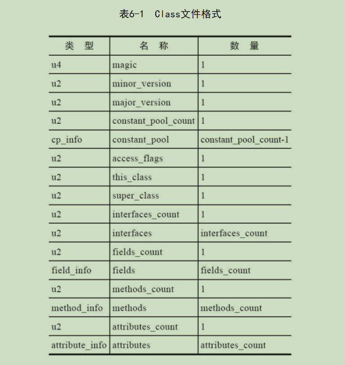

## class 二进制文件解释

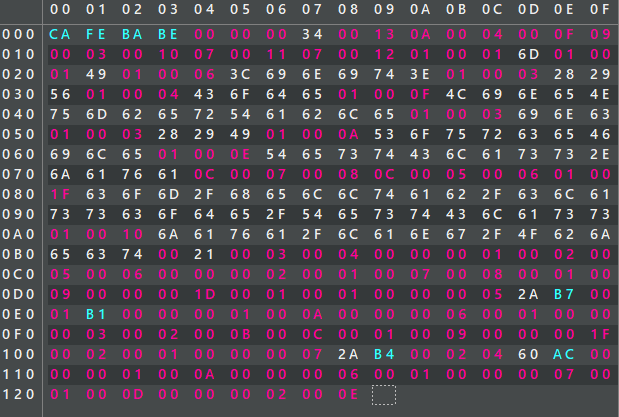

> **CA FE BA BE 00 00 00 34** 
>
> L: 00007
>
> 注意: 编码使用的是 LB, 即使高位在左边, 低位在右边
>
> - 第一个  u4 代表 class 文件的魔术数字: CAFE BABE 
>
> - 第二个 u4 代表 class 文件的次版本+主版本
>   - x0034 = 52: 52 - 45 + 1 = 8 (jdk1.8)
> - 如果第 5-6 为 ffff, 则为测试版本

> 

### 常量池

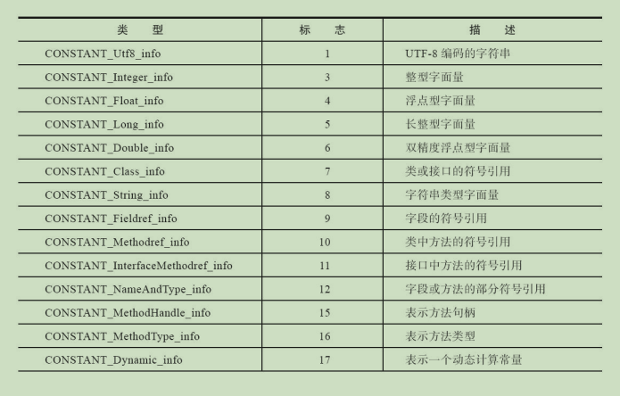

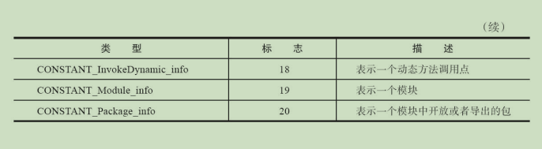

> **00 13**
>
> L: 0008-0009
>
> 常量池大小

> **0A**
>
> L: 0000A
>
> 常量标志位
>
> - 代表 10: 方法符号引用

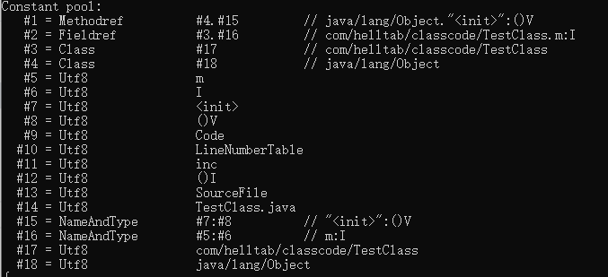

### 访问标志

> **00 21**
>
> L:0b003-04
>
> 访问标志
>
> - ACC_PUBLIC 和 ACC_SUPER 为真, 其余为假
> -  0x0001|0x0020 = 0x0021
> - 标志值经过设计,  通过与运算能得到相加的结果, 比如全为真 0xf631

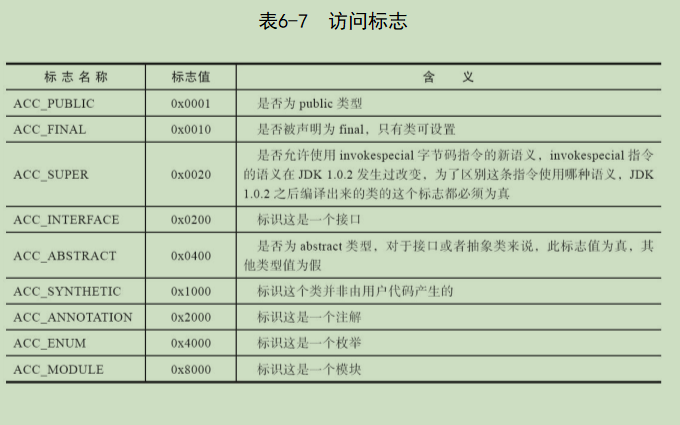

### 类索引/父类索引/接口索引

> **00 03 00 04 00 00**
>
> L: 0x0B005-0A
>
> 表示:
>
> - 类索引是常量池中的 #3
> - 父类索引是 #4
> - 接口集合为 0

### 字段表

> **00 01 00 02 00 05 00 06 00 00**
>
> L: 0x0B00B-0C004
>
> 表示: 
>
> - 0001 字段数量为 1
> - 0002 访问控制为 private
> - 0005 名称索引为 #5
> - 0006  描述符索引为 #6
> - 0000 属性表为空

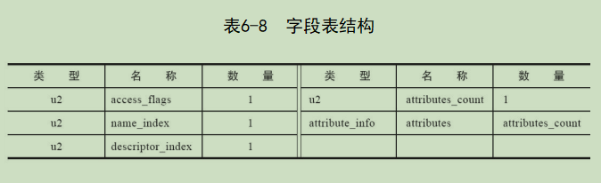

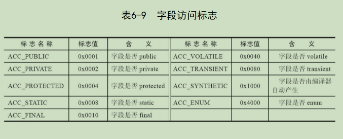

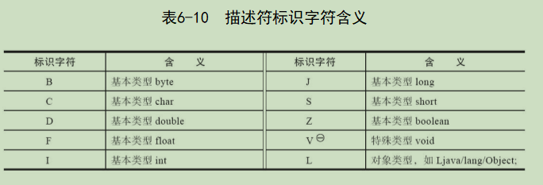

### 方法表

>**00 02 00 01 00 07 00 08 00 01 00 09 **
>
>L: 0x0C005-0D000
>
>表示: 
>
>- 数量为 2
>- 访问权限为 public
>- 名称 #7
>- 描述符 #8
>- 属性数量为 1
>- 属性为 #9

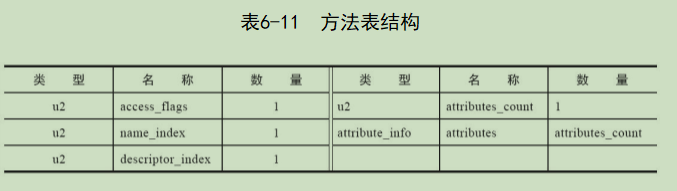

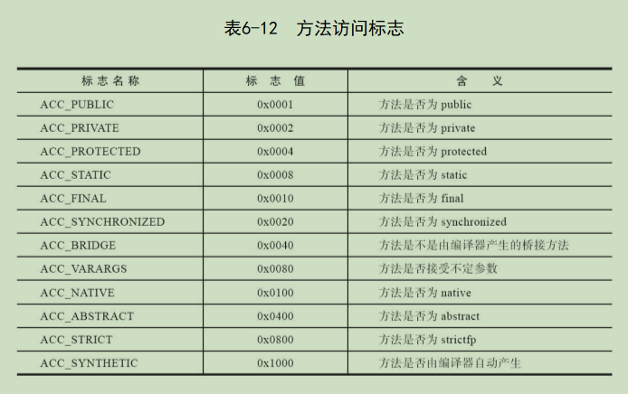

### 属性表集合

