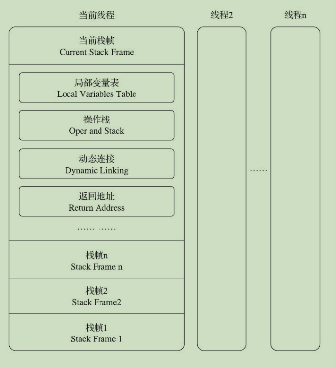
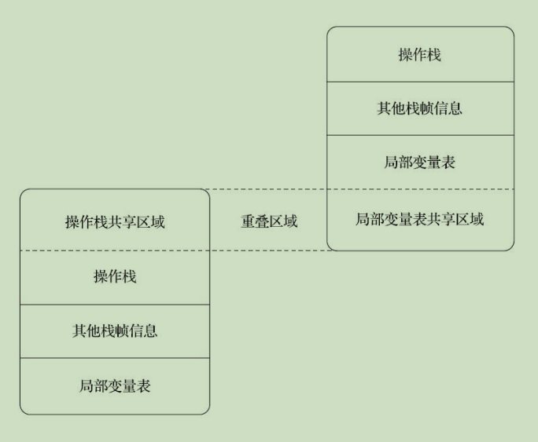
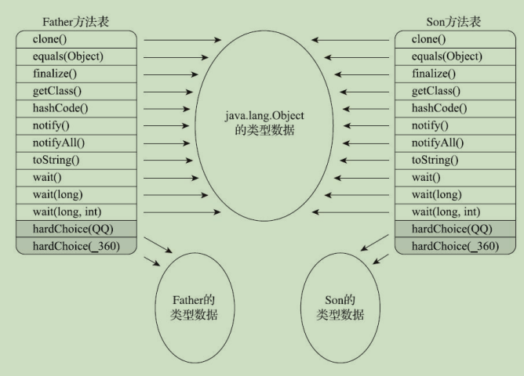

## 虚拟机栈



### 局部变量表 Local Variables Table

> 局部变量表（Local Variables Table）是一组变量值的存储空间，用于存放方法参数和方法内部定义的局部变量。
>
> 在Java程序被编译为Class文件时，就在方法的Code属性的max_locals数据项中确定了该方法所需分配的局部变量表的最大容量
>
> 大小: max_locals

> 1. 局部变量变量槽: 存储数据要求必须是 32 位能存储的数据结构, 若操作系统为 64 位, 应当补空白以达到类似的表现, 如果是 long 和 double, 则需要使用两个变量槽来存储
>
> 2. 变量槽可以被复用, 但是这样会导致变量在作用域内发生 gc 无法被清空的副作用, 可以用 {} 来限制变量的作用域
> 3. 局部变量表的变量只有一次赋值机会, 因此没有被初始化的变量是完全无法使用的; (初始化阶段会为变量赋初始值, 但是这里不会)
> 4. 
>
> 

### 操作数栈 Operand Stack 

> 局部变量表（Local Variables Table）是一组变量值的存储空间，用于存放方法参数和方法内部定义的局部变量
>
> 大小: max_stacks

> - 32 位数据占用 1 个栈容量, 64 位数据占用 2 个栈容量 (就是栈深度)
> - 操作数栈的变量类型一定和操作指令是完全一致的
>
> 

> 操作栈和局部变量表重叠区域



### 动态连接

> 每个栈帧都包含一个指向运行时常量池中该栈帧所属方法的引用，持有这个引用是为了支持方法调用过程中的动态连接（Dynamic Linking）

### 方法返回地址

> 当一个方法开始执行后，只有两种方式退出这个方法
>
> 1. 执行引擎遇到任意一个方法返回的字节码指令
> 2. 在方法执行的过程中遇到了异常，并且这个异常没有在方法体内得到妥善处理

### 附加信息

## 方法调用

### 解析

> **编译期可知，运行期不可变**
>
> - 静态方法
> - 私有方法
> - 实例构造器
> - 父类方法
> - 相关指令
>   - invokestatic 用于调用静态方法
>   - invokespecial 用于调用实例构造器<init>()方法、私有方法和父类中的方法
>   - invokevirtual 用于调用所有的虚方法 (所有被 override 的方法)
>     - final 方法虽然是用这个指令来调用, 但他实际上是一个非虚方法
>   - invokeinterface 用于调用接口方法，会在运行时再确定一个实现该接口的对象
>   - invokedynamic 先在运行时动态解析出调用点限定符所引用的方法，然后再执行该方法

### 分派 Dispatch

> 众所周知，Java是一门面向对象的程序语言，因为Java具备面向对象的3个基本特征：继承、封装和多态。
>
> 这里讲的就是**多态**

### 静态分派

> 重载（Overload）

```java
/**
 * 方法静态分派演示 
 */
public class StaticDispatch {
    static abstract class Human {
    }

    static class Man extends Human {
    }

    static class Woman extends Human {
    }

    public void sayHello(Human guy) {
        System.out.println("hello,guy!");
    }

    public void sayHello(Man guy) {
        System.out.println("hello,gentleman!");
    }

    public void sayHello(Woman guy) {
        System.out.println("hello,lady!");
    }

    public static void main(String[] args) {
        Human man = new Man();
        Human woman = new Woman();
        StaticDispatch sr = new StaticDispatch();
        sr.sayHello(man);
        sr.sayHello(woman);
    }
}
// 运行结果
// hello,guy!
// hello,guy!
```

> 分析: 
>
> - Human”称为变量的“静态类型”（Static Type），或者叫“外观类型”（Apparent Type） 
> - 后面的“Man”则被称为变量的“实际类型”（Actual Type）或者叫“运行时类型”（Runtime Type）
> - 静态类型是在编译期可知的
> - 实际类型变化的结果在运行期才可确定
> - 所有依赖静态类型来决定方法执行版本的分派动作，都称为静态分派

```java
/**
 * 重载方法匹配优先级
 */
public class Overload {
//    public static void sayHello(Object arg) {
//        System.out.println("hello Object");
//    }

//    public static void sayHello(int arg) {
//        System.out.println("hello int");
//    }

//    public static void sayHello(long arg) {
//        System.out.println("hello long");
//    }

//    public static void sayHello(Character arg) {
//        System.out.println("hello Character");
//    }

//    public static void sayHello(char arg) {
//        System.out.println("hello char");
//    }

    public static void sayHello(char... arg) {
        System.out.println("hello char ...");
    }

    public static void sayHello(Serializable arg) {
        System.out.println("hello Serializable");
    }

//    public static void sayHello(Comparable arg) {
//        System.out.println("hello Serializable");
//    }

    public static void main(String[] args) {
        sayHello('A');
    }
}
// 运行结果
//char -> int -> long -> Character -> Serializable/Comparable(同时存在会报错: Ambiguous method call. Both) -> Object -> [Lchar
```

### 动态分派

> 重写（Override）

> java 中的动态分派
>
> - 在编译期间: 会确定静态变量 Father, 因此宗量为 Father(h(x)) 中的 h(x), 由参数决定, 因此是多宗量的
>   - 称为静态多分派
> - 在运行期间, 编译阶段已经确定了son.hardChoice(new 360()) 中的 h(x), 方法的签名已经确定, 因此宗量为 1, 不确定的是方法的接受者 son
>   - 称为动态单分派
> - 因此 java 中目前的动态分派: 静态多分派 + 动态单分派

```java
Father father = new Father();
Father son = new Son();
father.hardChoice(new QQ());
son.hardChoice(new 360());
```


### 虚方法

> 虚方法表中存放着各个方法的实际入口地址。
>
> - 如果某个方法在子类中没有被重写，那子类的虚方法表中的地址入口和父类相同方法的地址入口是一致的，都指向父类的实现入口。
>
> - 如果子类中重写了这个方法，子类虚方法表中的地址也会被替换为指向子类实现版本的入口地址。
> - 在下图中，Son重写了来自Father的全部方法，因此Son的方法表没有指向Father类型数据的箭头。但是Son和Father都没有重写来自Object的方法，所以它们的方法表中所有从Object继承来的方法都指向了Object的数据类型。



## 方法句柄

> 动态获取方法接受者, 可以实现方法传参这样的动态调用了
>
> 和反射机制得到的结果很类似
>
> - 方法句柄是在模拟字节码的运行, 而反射是在模拟 java 代码的运行
> - 反射更加重量级
> - 方法句柄是字节码层面上的模拟, 和 java 语言并无直接绑定关系

```java
/**
 * 方法句柄
 */
public class MethodHandleTest {
    static class ClassA {
        public void println(String s) {
            System.out.println(s);
        }
    }

    public static MethodHandle getPrintlnMH(Object receiver) throws NoSuchMethodException, IllegalAccessException {
        // MethodType：代表“方法类型”，包含了方法的返回值（methodType()的第一个参数）和
        // 具体参数（methodType()第二个及以后的参数）。
        MethodType methodType = MethodType.methodType(void.class, String.class);
        // lookup()方法来自于MethodHandles.lookup，这句的作用是在指定类中查找符合给定的方法
        // 名称、方法类型，并且符合调用权限的方法句柄。
        // 因为这里调用的是一个虚方法，按照Java语言的规则，方法第一个参数是隐式的，代表该方法的接
        // 收者，也即this指向的对象，这个参数以前是放在参数列表中进行传递，现在提供了bindTo()
        // 方法来完成这件事情。
        return lookup().findVirtual(receiver.getClass(), "println", methodType).bindTo(receiver);
    }

    public static void main(String[] args) throws Throwable {
        Object obj = System.currentTimeMillis() % 2 == 0 ? System.out : new ClassA();
        getPrintlnMH(obj).invoke("hhhhh");
    }
}
```

