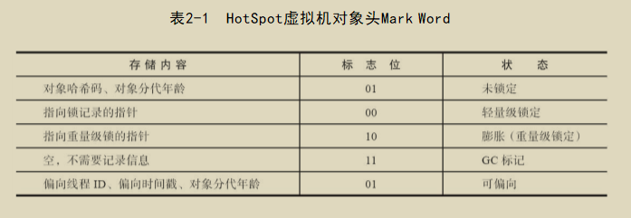
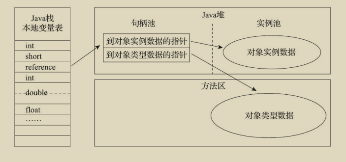
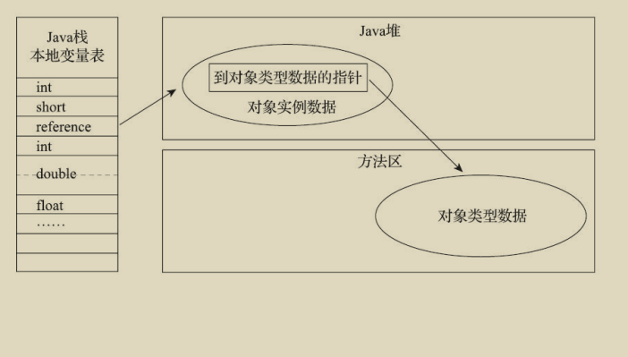

## 对象内存存储




> Mark Word
>
> 	32个比特存储空间中
>
> 		25个比特用于存储对象哈希码，
>
> 		4个比特用于存储对象分代年龄，
>
> 		2个比特用于存储锁标志位，
>
> 		1个比特固定为0

>  markOop.cpp片段

```cpp
// Bit-format of an object header (most significant first, big endian layout below):
//
//  32 bits:
//  --------
//  hash:25 ------------>| age:4    biased_lock:1 lock:2 (normal object)
//  JavaThread*:23 epoch:2 age:4    biased_lock:1 lock:2 (biased object)
//  size:32 ------------------------------------------>| (CMS free block)
//  PromotedObject*:29 ---------->| promo_bits:3 ----->| (CMS promoted object)

```

## 访问对象

> 句柄方式访问
>
> 好处: 一旦对象发生变化(比如移动), 类型指针不发生变化



> 直接指针访问
>
> 好处: 访问速度快,  少了一次指针的定位时间



## 实战

> 堆内存溢出 **HeapOOM.java**
>
> - -XX:+HeapDumpOnOutOfMemoryError: 参数表示当JVM发生OOM时，自动生成DUMP文件

```java
/**
 * -Xms20m -Xmx20m -XX:+HeapDumpOnOutOfMemoryError
 */
public class HeapOOM {
    public static void main(String[] args) {
        List<HeapOOM> list = new ArrayList<>();
        while (true) {
            list.add(new HeapOOM());
        }
    }
}
// 运行结果
//java.lang.OutOfMemoryError: Java heap space
//Dumping heap to java_pid18192.hprof ...
//Heap dump file created [28245439 bytes in 0.054 secs]
```

> 虚拟机栈溢出 **JVMStackSOF**
>
> - -Xss108k :  
>   - The stack size specified is too small, Specify at least 108k

```java
/**
 * -Xss108k
 */
public class JVMStackSOF {
    public int stackLeagth = 1;

    public void stackLeak() {
        stackLeagth++;
        stackLeak();
    }

    public static void main(String[] args) {
        JVMStackSOF jvmStackSOF = new JVMStackSOF();
        try {
            jvmStackSOF.stackLeak();
        } catch (Throwable e) {
            System.out.println("stackLeagth: " + jvmStackSOF.stackLeagth);
//            throw e;
        }
    }
}
// 运行结果
// stackLeagth: 982
```

> 永久代溢出 **RuntimeConstantPoolOOM**
>
> jdk7 以上就不再出现这个错误了, 因为 jdk7 原本存放在永久代的字符串常量池被移至 Java 堆之中 
>
> - 比较有意思的是, jdk6 以前, 常量池在永久代里, 因此 `String.intern() (常量池)和 new String() (堆)`一定不在一个区域, jdk7 之后,  String.intern() 会将**第一次遇到的字符串**放入常量池, 因此`String.intern() (常量池)和 new String() (堆)`可能会在一个区域

```java
/**
 * jdk 6
 * -XX:PermSize=6M -XX:MaxPermSize=6M
 */
public class RuntimeConstantPoolOOM {
    public static void main(String[] args) {
        Set<String> set = new HashSet<String>();
        short i = 0;
        while (true) {
            set.add(String.valueOf(i++).intern());
        }
    }
}
// 运行结果 
//Exception in thread "main" java.lang.OutOfMemoryError: PermGen space
//                     at java.lang.String.intern(Native Method)
//                     at com.helltab.oom.RuntimeConstantPoolOOM.main(RuntimeConstantPoolOOM.java from InputFileObject:14)
```

> 借助CGLib使得方法区出现内存溢出异常 **JavaMethodAreaOOM**
>
> jdk8 开始就不支持 -XX:PermSize 了
>
> - -XX:MetaspaceSize=2M -XX:MaxMetaspaceSize=2M

```java
/**
 * jdk7 -XX:PermSize=2M -XX:MaxPermSize=2M
 * jdk8 -XX:MetaspaceSize=2M -XX:MaxMetaspaceSize=2M
 */
public class JavaMethodAreaOOM {
    public static void main(String[] args) {
        while (true) {
            Enhancer enhancer = new Enhancer();
            enhancer.setSuperclass(OOMObject.class);
            enhancer.setUseCache(false);
            enhancer.setCallback(new MethodInterceptor() {
                @Override
                public Object intercept(Object obj, Method method, Object[] args, MethodProxy proxy) throws Throwable {
                    return proxy.invokeSuper(obj, args);
                }
            });
            enhancer.create();
        }
    }

    static class OOMObject {
    }
}
// jdk7 运行结果
//java.lang.OutOfMemoryError: PermGen space
//    at sun.misc.Launcher.<init>(Launcher.java:71)
//    at sun.misc.Launcher.<clinit>(Launcher.java:57)
//    at java.lang.ClassLoader.initSystemClassLoader(ClassLoader.java:1489)
//    at java.lang.ClassLoader.getSystemClassLoader(ClassLoader.java:1474)


// jdk8 运行结果
//OutOfMemoryError: Metaspace
```

> 本机直接内存溢出 
>
> - 直接内存（Direct Memory）的容量大小可通过-XX：MaxDirectMemorySize参数来指定，如果不去指定，则默认与Java堆最大值（由-Xmx指定）一致
> - 由直接内存导致的内存溢出，一个明显的特征是在Heap Dump文件中不会看见有什么明显的异常情况，如果发现内存溢出之后产生的 **Dump 文件很小**，而程序中又直接或间接使用了 DirectMemory（典型的间接使用就是NIO），那就可以考虑重点检查一下直接内存方面的原因了。

```java
/**
 * VM Args：-Xmx20M -XX:MaxDirectMemorySize=10M
 */
public class DirectMemoryOOM {
    public static final int _1Mb = 2 << 19;

    public static void main(String[] args) throws IllegalAccessException {
        Field field = Unsafe.class.getDeclaredFields()[0];
        field.setAccessible(true);
        Unsafe unsafe = (Unsafe) field.get(null);
        int i = 0;
        try {
            while (true) {
                i++;
                unsafe.allocateMemory(_1Mb);
            }
        } catch (Throwable e) {
            System.out.println(++i);
            e.printStackTrace();
        }
    }
}
// 运行结果
//46382
//java.lang.OutOfMemoryError
// at sun.misc.Unsafe.allocateMemory(Native Method)
```