> jdk5 需要开启 -Dcom.sun.management.jmxremote

> -X: 非标准参数
>
> -XX: 不稳定参数

## jps

> 查看 java 运行线程
>
> jps [ options ] [ hostid ]

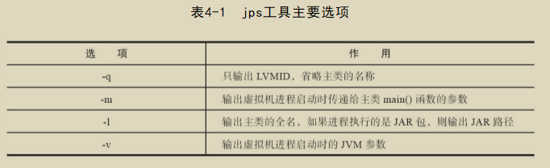

## jstat

> 虚拟机统计信息监视工具
>
> jstat [ option vmid [interval[s|ms] [count]] ]

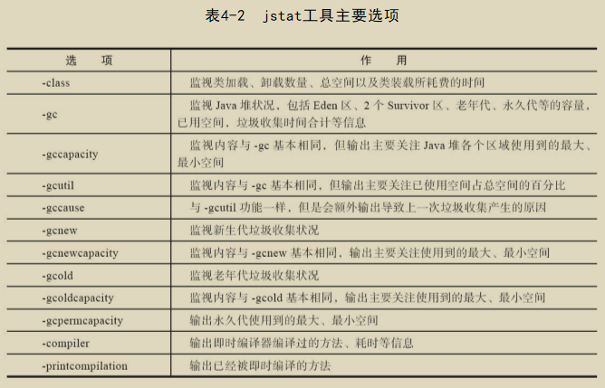

## jinfo

> Java配置信息工具
>
> jinfo [ option ] pid

## jmap

> 命令用于生成堆转储快照
>
> jmap [ option ] vmid

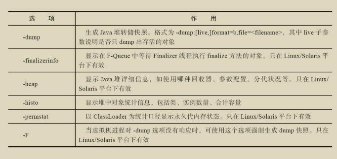

## jhat

> 虚拟机堆转储快照分析工具
>
> 用于分析上述生成的 bin 文件, 但是这个服务比较耗内存, 一般要在另外的服务器上面去进行分析

## jstack

> Java堆栈跟踪工具
>
> jstack [ option ] vmid

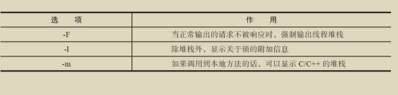

## 其他

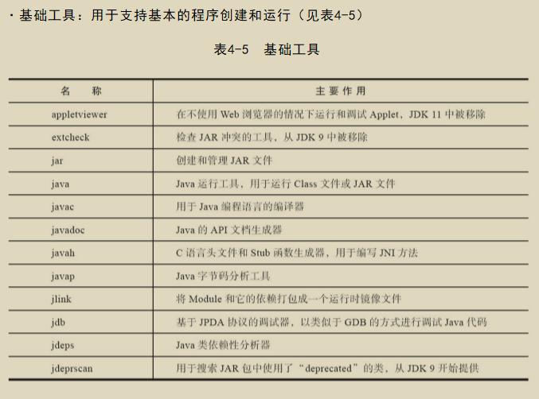

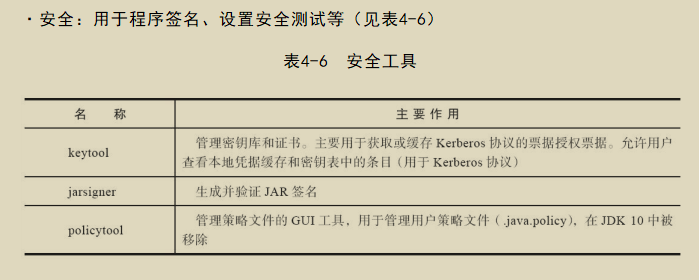

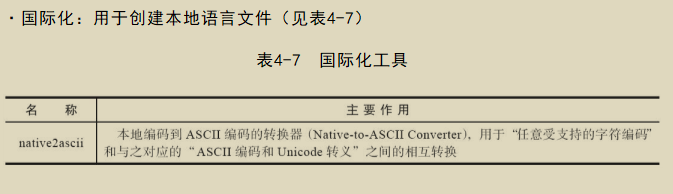

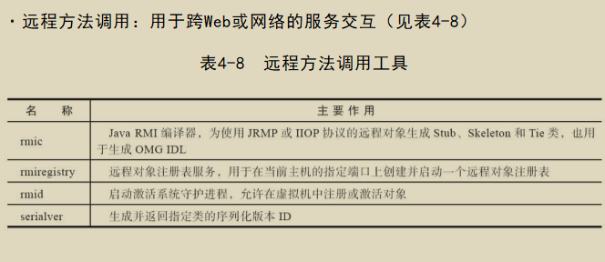

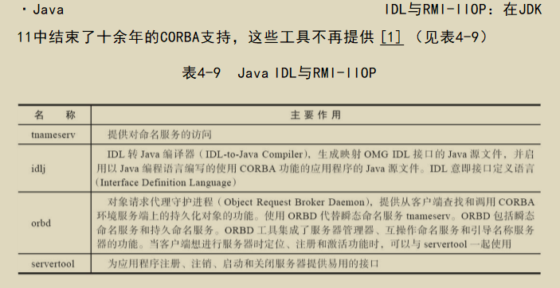

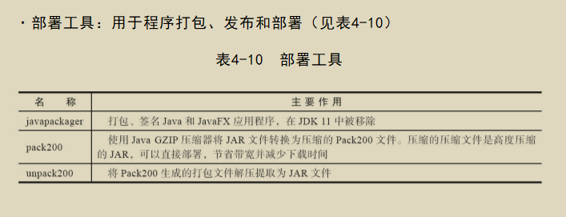

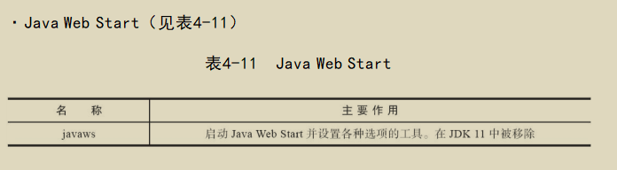

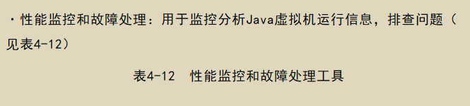

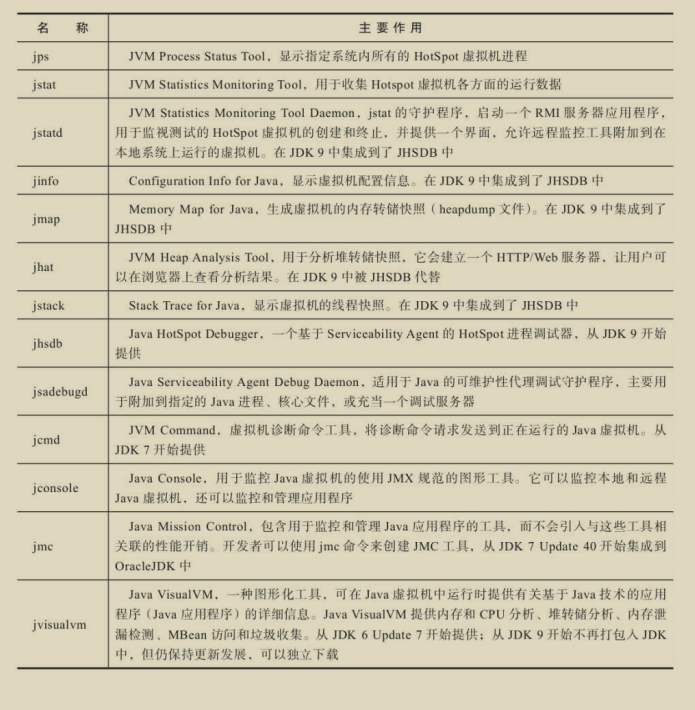

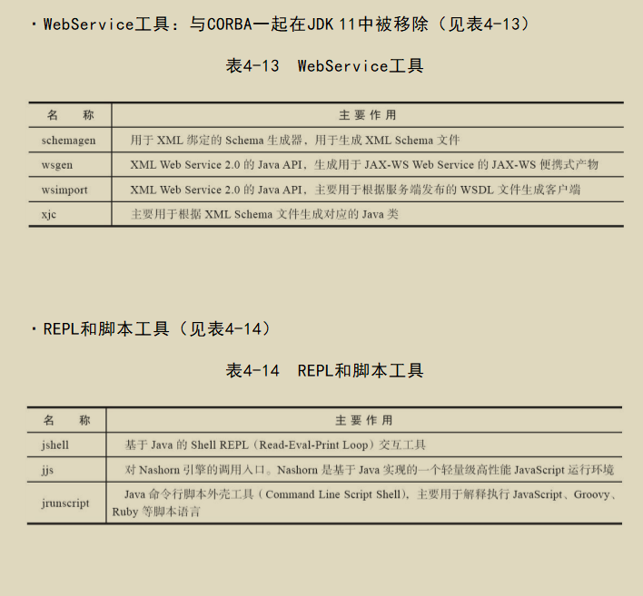