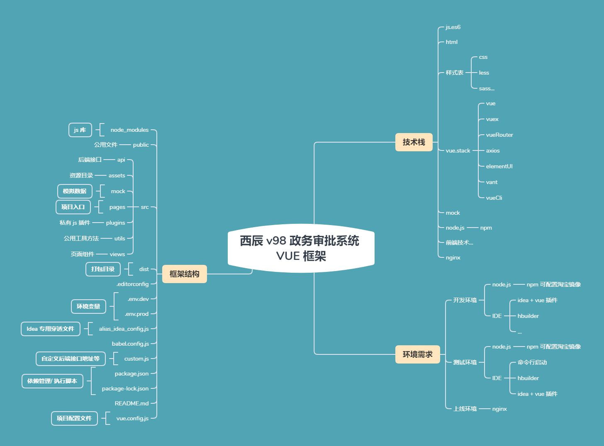

## 框架思维导图预览


## 开发指南

### 开发环境

|  序  |    名称     |                 来源                 |                             描述                             | 必要 |     注意事      |
| :--: | :---------: | :----------------------------------: | :----------------------------------------------------------: | ---- | :--------------: |
|  1   |  `node.js`  |      https://nodejs.org/zh-cn/       | Node.js® 是一个基于 [Chrome V8 引擎](https://v8.dev/) 的 JavaScript 运行时 | 是   | 一般最新版本即可 |
|  2   |   `idea`    |      https://www.jetbrains.com/      |               IDE 编辑器, 必须要安装 vue 插件                |      |     需要激活     |
|  3   | `HBuilderX` | https://www.dcloud.io/hbuilderx.html |                 IDE 编辑器, 不如 `idea` 强大                 | 否   |                  |
|  4   |    `...`    |                                      |                                                              |      |                  |


### 从零开始搭建

> 1. 安装 node.js , 确认包管理 npm 可用, 添加淘宝仓库
>
>    ```sh
>    > node -v
>    v12.16.1
>    > npm -v
>    6.13.4
>    # 设置淘宝源
>    > npm config set registry https://registry.npm.taobao.org
>    # 查看仓库是否已经替换为淘宝源
>    > npm config get registry
>    
>    -----------------------------------------------------------------------------
>    > npm install -g yarn
>    # 查看版本
>    > yarn --version
>    # 设置源
>    > yarn config set registry https://registry.npm.taobao.org -g
>    > yarn config set sass_binary_site http://cdn.npm.taobao.org/dist/node-sass -g
>    ```
>
> 2. 安装 vue cli
>
>    ```sh
>    > npm install -g @vue/cli
>    > vue -V
>    @vue/cli 4.3.1
>    
>    ----------------------------------------------------------------------------
>    > yarn install -g @vue/cli
>    >
>    
>    ```
>
> 3. 新建一个文件夹作为项目组目录, 在目录中新建 vue 项目
>
>    ```sh
>    > vue create project_name
>    # 选择需要的组件, 最后等待项目构建完毕
>    ```
>
> 4. 认识一下构建后的项目
>
>    | 文件目录          | 类型 | 描述           |
>    | ----------------- | ---- | -------------- |
>    | node_modules      | 目录 | js 包目录      |
>    | public            | 目录 | 公用资源文件夹 |
>    | src               | 目录 | 源码目录       |
>    | .browserslistrc   | 文件 | 浏览器兼容     |
>    | babel.config.js   | 文件 | js 语法兼容    |
>    | package.json      | 文件 | 依赖管理/ 脚本 |
>    | package-lock.json | 文件 | 依赖小版本锁定 |
>    | README.md         | 文件 | 自述文件       |
>
>    > 1. 执行 `npm run serve ` 即可运行项目
>    > 2. 入口在 **src** 下的 **main.js**
>    > 3. 根组件是 **src** 下的 **app.vue**
>
> 5. 项目配置部分 **(重要)**
>
>    **如果使用 idea 进行开发, 需要安装 vue 插件, 并新建一个 alias_idea_config.js**
>
>
>    ```js
>    // alias_idea_config.js
>
>    // 此文件未使用，只是为了让idea可以识别实际位置
>    const path = require("path");
>    function resolve (dir) {
>        return path.join(__dirname, dir);
>    }
>
>    module.exports = {
>        resolve: {
>            alias: {
>                '@': resolve('src'),
>                '@queryH': resolve('src/views/query/h'),
>                '@queryV': resolve('src/views/query/v'),
>                '@quhaojiH': resolve('src/views/quhaoji/h'),
>                '@quhaojiV': resolve('src/views/quhaoji/v'),
>            },
>        },
>    };
>    ```
>
> 
>
>    **新建文件 custom.js, 这是开发者自定义的配置, 只需检出一次, 无需更新**
>
>    ```js
>    // custom.js
> 
>    // 该文件检出后不再提交, 请添加到忽略列表
>     module.exports = custom
>     function custom() {
>    	return {
>            // 这个格式要保持
>    		sp_url: 'http://127.0.0.1:89/',
>    	}
>    }
>    ```
>
>    **新建.env.dev,  开发环境配置文件, 注意没有后缀**
>
>    ```js
>    NODE_ENV = 'development'
>    VUE_APP_BASE_API = 'vueBaseUrl'
>    ```
>
>    **新建.env.prod,  生产环境配置文件, 注意没有后缀**
>
>    ```js
>    NODE_ENV= 'production'
>    VUE_APP_BASE_API = 'prodUrl'
>    ```
>
>    **新建文件 vue.config.js, 这是核心配置文件, 支持 node.js 语法**
>
>    ```js
>    // vue.config.js
> 
>    // 这是每个开发者自定义的配置, 需要 custom.js
>    const custom = require('./custom.js')()
>    const isProduction = process.env.NODE_ENV === 'production'
>    const BundleAnalyzerPlugin = require('webpack-bundle-analyzer').BundleAnalyzerPlugin
>    const CompressionWebpackPlugin = require('compression-webpack-plugin')
>    const productionGzipExtensions = ['js', 'css']
>    // 基础配置
>    module.exports = {
>        publicPath: '/',
>        outputDir: 'dist/' + projectname,// 打包输出路径
>        devServer: {
>            host: '0.0.0.0',
>            port: 81,
>            proxy: {
>                /**
>                 * 跨域代理, 注意target后面的斜杠不能省略
>                 * 生产环境需要用nginx做反向代理
>                 */
>                '/vueBaseUrl': {
>                    target: custom.sp_url, // 开发
>                    changeOrigin: true,
>                    pathRewrite: {
>                        '^/vueBaseUrl': '/'
>                    }
>                }
>            },
>            https: false,
>            hotOnly: false,
>        },
> 
>        chainWebpack: config => {
>            // 别名设置
>            config.resolve.alias
>                .set("vue$", "vue/dist/vue.esm.js")
>                .set("@", resolve("src"))
>            // 打包分析
>            // `npm install --save-dev webpack-bundle-analyzer`
>            if (isProduction) {
>                config.plugin('webpack-report')
>                    .use(BundleAnalyzerPlugin, [{
>                        analyzerMode: 'static',
>                    }])
>            }
> 
>        },
>        // 打包压缩
>        //`npm install compression-webpack-plugin --save-dev`
>        configureWebpack: config => {
>            if (isProduction) {
>                config.plugins.push(new CompressionWebpackPlugin({
>                    algorithm: 'gzip',
>                    test: new RegExp('\\.(' + productionGzipExtensions.join('|') + ')$'),
>                    threshold: 10240,
>                    minRatio: 0.8
>                }))
>            }
>        },
>    }
>    ```
>
>    **多模块配置**
>
>    > `背景说明`: vue 项目为单页面项目, 如果想在同一个项目中开发, 并使用现有的工具, 需要构建多模块项目
>    >
>    > `额外说明`: 多模块打包是分开打包的, 也就是 dist 下面是分开的各个模块的打包文件
>    >
>    > `优点`: 可以使用项目公用的工具 / 配置 / 接口, 便于统一管理
>    >
>    > `缺点`: 多模块使得项目变得复杂, 抽象难度更高
>    >
>    > `步骤`:
>    >
>    > [Vue 多模块构建](./assets/vue 框架多模块构建方法.md)
>
> 6. `...`

### 功能设计 (多模块)

| SRC 下目录结构 | 功能描述     | 注意事项                                                     | 是否自有 |
| -------------- | ------------ | ------------------------------------------------------------ | -------- |
| api            | 接口         | 注意是否与公有接口冲突                                       | 否       |
| assets         | 资源目录     | 分类存放, 切记频繁修改, 会影响项目引用                       | 是       |
| mock           | 模拟数据接口 | 会拦截所有的请求, 在测试后台时需要注释掉对应的接口           | 否       |
| pages          | 多模块入口   | 参见 [Vue 多模块构建](./西辰 v98 政务审批系统 VUE 框架技术文档.assets/vue 框架多模块构建方法.md) | 否       |
| plugins        | 自定义插件   | 注意符合插件编写规范                                         | 否       |
| utils          | 公用方法     | 最公用的方法, 如果不是多模块适用的, 请引用到私有模块         | 否       |
| views          | 页面组件     | 注意分模块和分功能                                           | 否       |


1. 接口设计

   1. 在 util 中新建文件 request.js

   ```js
   //request.js

   // `npm install axios`
   import axios from 'axios'

   /**
    * axios 实例
    * @type {AxiosInstance}
    */
   const service = axios.create({
       // 如果是 hash 路由, 不用加 /, history 必须加, 因此都加上
       baseURL: `/${process.env.VUE_APP_BASE_API}`,
       // timeout: 10000
   })

   /**
    * 请求实例
    */
   service.interceptors.request.use(
       config => {
           //console.log(config)
           // 请求生命周期: config
           return config
       },
       error => {
           // 请求生命周期: error
           console.log(error);
           return Promise.reject(error)
       }
   )

   /**
    * 返回实例
    */
   service.interceptors.response.use(
       // 返回值 (Promise)
       response => {
            // 返回生命周期: response
           return Promise.resolve(response.data)
       },
       error => {
            // 返回生命周期: error
           return Promise.reject(error)
       }
   )

   export default service
   ```


   2. 在 `api` 目录下新建接口文件, 如 `commonApi.js`

   ```js
   //commonApi.js
   import request from '@/utils/request'

   const common = {
       list_repeat_licence : 'commonApi/listRepeatLicence',
   }
   /**
    * 证照复用
    * @param query{cardNo, companyNo}
    * @returns {AxiosPromise}
    */
   export function listRepeatLicence(query) {
       return request({url: common.list_repeat_licence, method: dict.API.METHOD.GET, params: query})
   }
   ```


   3. 调用

   ```js
   import {listRepeatLicence} from "@/api/commonApi";
   async created() {
       await listRepeatLicence({cardNo, companyNo}).then(res=>{
           // todo
       })
   },
   ```

2. 模拟数据

   1. 在 `mock` 目录下新建 `index.js`

      ```js

      import Mock from 'mockjs'

      import dict from '@/pages/device/utils/dict'
      import bigData from './modules/bigData'

      const Random = Mock.Random

      Mock.mock(RegExp('commonApi/treeReg' + '.*'), 'get', (data) => {
          return {data: [{id: 1, regName: '西虹市'}]}
      })
      ```


   2. 使用

      ```js
      // mian.js

      import '@/mock'
      ```


3. 公用方法

   1. 在 `util` 中新建 `common.js`,  注意下面对路由处理的代码

      ```js
      // common.js

      // 说明: 因为是多模块应用, 路由每个模块都有一个, 因此在使用本公用方法的时候, 需要区别路由是哪个模块的 (也有其他的处理方式), 下面是遍历所有的路由模块, 并判断当前环境是哪个路由.
      let router = null, routers = []
      const modulesFiles = require.context('@/pages/', true, /router\/index.js/)
      modulesFiles.keys().reduce((modules, modulePath) => {
          let temp = modulesFiles(modulePath).default
          routers.push(temp)
      }, {})

      setTimeout(() => {
          routers.forEach(r => {
              if (!!r.app) {
                  router = r
              }
          })
      }, 0)

      ```


   2. 其他模块可引入继承上面的 `common.js`

      ```js
      import commonUtil from '@/utils/common'
      import Vue from 'vue'
      // vue 上下文
      const utilVueContext = new Vue({name: 'util'})
      // 可以放公用方法
      export default {
          // 引入全公用方法
          ...commonUtil,
      }
      ```

4. 路由设计

   1. 多模块需要各自新建 `router` 目录

   2. 在 `router` 目录下面新建 `index.js` 和 `modules` 目录

      ```js
      import Vue from 'vue'
      import Router from 'vue-router'
      import fillFormRouter from './modules/fillFormRouter'
      Vue.use(Router);
      export default new Router({
          // mode: 'history',
          routes: [
              {
                  path: '/',
                  name: 'DeviceIndex',
                  component: DeviceIndex
              },
              fillFormRouter
          ],
      })

      /**
       * 下面代码禁止路由重复跳转打印报错信息(重写)
       * @type {Router.push|*}
       */
      const originalPush = Router.prototype.push, originalReplace = Router.prototype.replace;
      Router.prototype.push = function push(location, onResolve, onReject) {
          if (onResolve || onReject) return originalPush.call(this, location, onResolve, onReject);
          return originalPush.call(this, location).catch(err => err)
      };
      Router.prototype.replace = function replace(location, onResolve, onReject) {
          if (onResolve || onReject) return originalReplace.call(this, location, onResolve, onReject);
          return originalReplace.call(this, location).catch(err => err)
      };
      ```

   3. 在 `modules` 下新建具体的路由文件, 如:

      ```js
      const fillFormRouter = {
        path: '/fillForm',
        component: () => import('@/pages/device/components/fillForm/FillFormApp'),
        hidden: true,
        meta: {
            appFlag: true, // 是否是起始页
        },
        children: [
          {
            path: 'Index',
            meta: {
              homeFlag: true, // 是否是首页
            },
            component: () => import('@/views/fillForm/Index')
          }
        ]
      }
      export default fillFormRouter
      ```

   4. **特别说明**

      1. 智能设备模块有特殊的处理, 因为一个模块下有多个设备, 因此 `app.vue` 作为根节点已经不够了, 需要创建各个设备的首页组件

         1. 在 `device/components` 下新建 `DeviceIndex.vue` 作为导航首页

            ```vue
            ...
            ```


         2. 在 `device/components/tv` 下新建 `TvApp.vue` 作为电视的真正入口
    
            ```vue
            <template>
                <div>
                    <router-view></router-view>
                </div>
            </template>
            <script>
                import Vuex from 'vuex';
                export default {
                    name: "TvApp",
                    // 直接跳转到真正的内容首页
                    created: function () {
                        this.$router.replace('/tv/Index')
                    },
                }
            </script>
            <style>
            </style>
            ```


5. 资源文件

   1. 如何引用 `assets` 目录下面的文件, 举例如下

      ```vue
      <template>
          <div>
              <!--相对路径, 文件移动需要重新定位-->
              
              <!--相对绝对路径, 不能穿透-->
              
              <!--推荐, 在 idea 中能穿透, 还是相对绝对路径-->
              
          </div>
      </template>
      ```

   2. 如何在样式表中引用资源文件, 举例如下

      ```vue
      <template>
          <div class="test_img"></div>
      </template>
      <style scoped>
          .test_img {
              height: 100px;
              width: 100px;
              /*相对路径, 文件移动需要重新定位*/
              /*background: url("../../assets/website/img/personal-center/face.png");*/
               /*相对绝对路径, 不能穿透*/
              /*background: url("~@/assets/website/img/personal-center/face.png");*/
          }
      </style>
      ```

   3. **全局样式 (特别重要)**, 因为是单页面应用, 样式只要生效, 并且是全局的, 就都会影响到全局; 那么我们是不是可以不用全局样式, 或者只在一开始就定义好所有的全局样式呢? 下面的例子是例外:

      1. 当你想修改第三方的组件如 `elementUI`
      2. 当你想修改自己的子组件, 并且不希望在子组件上做修改的时候
      3. 手滑, 没有加上局部样式的属性 `scoped`

      > 如何解决上面的问题呢?
      >
      > 1. 应当始终加上如下标记
      >
      >    ```vue
      >    <style scoped></style>
      >    ```
      >
      > 2. 如果出现上述需求, 引入 `less` 处理器 (或其他 `CSS 预处理语言`), 去掉 `scoped` 属性, 添加 `lang="less"`
      >
      >    ```vue
      >    <template>
      >    	<div class="westar_identify">
      >            <!--todo-->
      >        </div>
      >    </template>
      >    <style lang="less">
      >        .westar_identify {
      >            /*todo*/
      >        }
      >    </style>
      >    ```
      >
      >

      > 样式是如何全局生效的: 当你访问到一个新页面, 新页面中包含全局样式, 就会加到整个**单页面**中, 会影响其他的页面组件


6. 自定义插件

   > 参见项目中的插件编写, 有时间再来写一篇关于 js 插件的文档

### 约定和约束

1. 约定

   1. 命名:

      1. 变量多使用下划线或者驼峰
      2. 类名使用短横线连接
      3. 方法名使用驼峰命名
      4. const 常量使用大写 + 下划线
      5. 枚举情况应当写入字典表中
      6. 接口命名使用驼峰, 接口中的 url 使用小写 + 下划线
      7. 尽量不用拼音, 除非是我们国家特有的词汇, 比如: 放管服

   2. vue 编码约定

      ```vue
      <template>
          <!--    这是组件根元素, 唯一且必要-->
          <div>
          </div>
      </template>

      <script>
          export default {
              // name 建议与文件名相同, 包括大小写
              name: "Rule",
              // data 建议这种写法, 而不是 data: function(){return {}}
              data() {
                  return {
                      // enums 存放一些判断性的变量
                      enums: {}
                  }
              },
              //执行数据的准备, 如果有多个接口需要处理, 请加上 async-await
              created() {
              },
              // 页面渲染成功后才处理
              mounted() {
              },
              // 数据过滤器, 对, 过滤! 页面上尽量少用判断, 先通过计算属性过滤后再使用
              computed() {
              },
              methods:{
                testRule() {
                    // 尽量使用箭头函数, 不损坏 vue 的 this 指向, 也很丝滑
                    setTimeout(()=>{
                        this.enums = {flag : true}
                    }, 0)
                }
              },
              // 尽量少用
              watch: {},
              // 清楚页面倒计时等内存
              beforeDestroy() {
              },
              components: {
                  // 如果页面一开始不需要该组件, 请用懒加载 (如下) 方式引入
                  mine: () => import("./mine")
              }

          }
      </script>

      <style scoped>

      </style>
      ```


   3. 方法抽象:

      1. 尽量使用 es6 新特性来精简代码
      2. 有两个以上调用的方法应当提取为公用
      3. 关键处应当有注释

   4. 注释:

      1. 方法注释 /**/
      2. 方法内部注释 //

   5. 多使用 `todo ` 来标注尚未完善的功能, 如果该功能已完善, 应当去掉该标记

2. 约束

   1. 不可使用硬编码, 魔法数字

   2. 不可绕过接口文件直接调用

   3. 不可使用拼音 + 英文的命名方式


### 开发流程

1. 从 svn 上检出代码

2. 导入 IDE, 这里默认是 idea

3. `alt + F12` 在终端中执行 `npm install` 或者 `cnpm install` , 如果失败, 可先执行 `npm cache clean -f`

4. 配置启动服务器为 `NPM` 启动项目 (也可终端执行 `npm run serve`)


5. 启动成功后, 无需刷新浏览器, 可实时预览修改页面 (websocket)

### 提交代码

1. 忽略 `node_modules` `dist`
2. 更新代码后, 习惯 `npm install`
3. ...

## 部署指南 ( 测试 )

### 环境以及部署

1. 下载 `node.js` 执行以下命令检测环境

   ```sh
   > node -v
   v12.16.1
   > npm -v
   6.13.4
   # 设置淘宝源
   > npm config set registry https://registry.npm.taobao.org
   # 查看仓库是否已经替换为淘宝源
   > npm config get registry
   ```

2. 修改 `custom.js` 中的接口地址为本地的后端接口地址

3. 可使用命令或者是 `idea` 来部署项目

   1. 命令, 在 `package.json` 所在的目录执行

      ``` sh
      # 导包
      > npm install
      # 如果安装了 cnpm(淘宝镜像),
      > cnpm install
      # 等待安装完成
      # 如果出现问题, 可删掉 node_modules 目录, 再执行以上命令
      > npm run serve
      # 等待运行成功
      ```

   2. `idea`, 配置启动服务器为 `NPM` 启动项目


## 上线指南 ( 实施 )

### 上线环境

> 服务器: `NGINX`

### 服务器配置

```shell

#吐槽系统
server {
	# 项目端口
    listen       886;
    server_name  localhost;
    # 项目地址
    root    D:\applicant\westar_talkin\vue;
    location / {
        index  index.html;
    }

    location /prodUrl/ {
        # 后端的真实接口
      proxy_pass http://localhost:82/;
      proxy_redirect off;
      proxy_set_header Host $host;
      proxy_set_header X-Real-IP $remote_addr;
      proxy_set_header X-Forwarded-For $proxy_add_x_forwarded_for;
      proxy_set_header   Cookie $http_cookie;
      # for Ajax
      #fastcgi_param HTTP_X_REQUESTED_WITH $http_x_requested_with;
      proxy_set_header HTTP-X-REQUESTED-WITH $http_x_requested_with;
      proxy_set_header HTTP_X_REQUESTED_WITH $http_x_requested_with;
      proxy_set_header x-requested-with $http_x_requested_with;
      client_max_body_size 10m;
      client_body_buffer_size 128k;
      proxy_connect_timeout 90;
      proxy_send_timeout 90;
      proxy_read_timeout 90;
      proxy_buffer_size 128k;
      proxy_buffers 32 32k;
      proxy_busy_buffers_size 128k;
      proxy_temp_file_write_size 128k;
    }
}
```


### 测试是否部署成功

> 浏览器运行项目端口

### 更新

> 不可增量更新, 必须备份后, 全量更新

