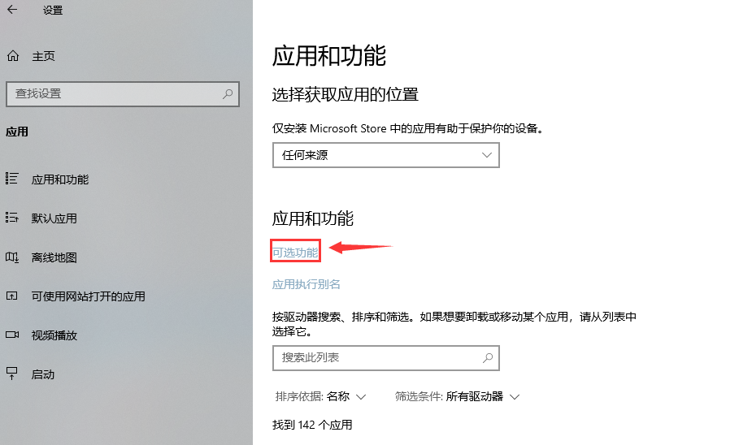
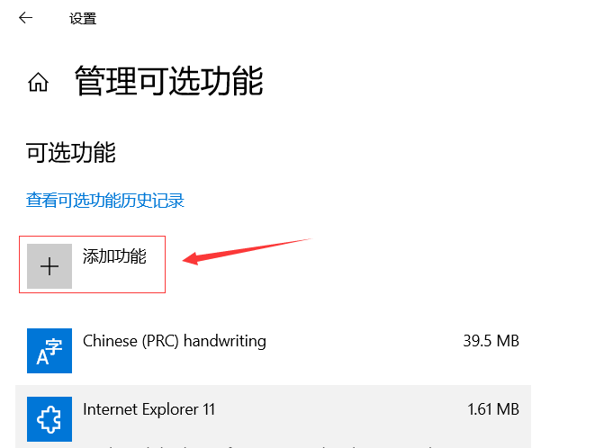
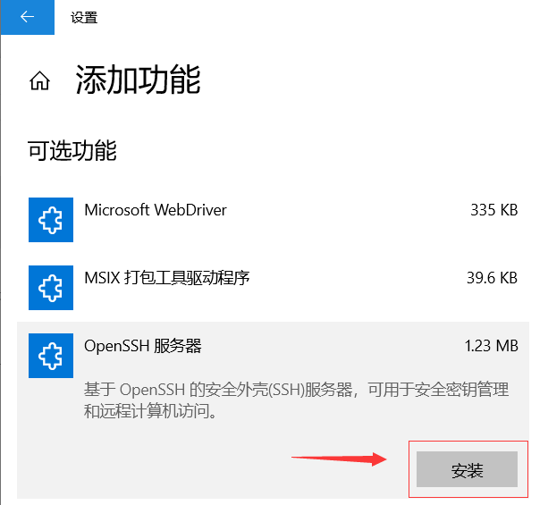

> vuepress 涉及到服务器部署, 为了方便操作, 我们需要借用 ssh 连接来发布更新
> linux 自带 ssh, windows 需要下载安装 openssh
## 安装 openssh
> windows 10 可以添加该功能  
> 打开设置 > 应用 > 可选功能 > 选择 openSSH > 点击安装 > 返回等待安装完毕



>
## 创建公钥, 免密认证
> 生成公钥, 一路回车就可以了  
>```bash
> ssh-keygen
>```
>
> 将用户目录下如 "C:/users/administrator/.ssh/id_rsa.pub" 打开, 复制内容  
> 粘贴到服务器上的 `administrators_authorized_keys(windows)` 或是 `authorized_keys(linux)` 末尾即可
