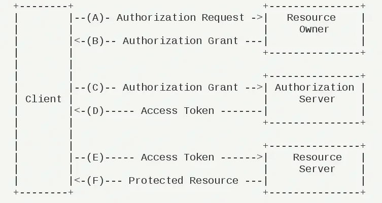

> 考察点: 安全性, 性能, 单点登录, 多点登录

## session 认证

> 将认证信息存放在 session 中, 根据请求的 sessionId 来判断是否认证
>
> 分布式系统需要共享 session
>
> 对移动端不友好

## jwt 认证

> 1. 服务器通过算法签发一个无状态的 jwt
> 2. 前端每次请求都携带 jwt
> 3. jwt 有一个过期时间, 过期作废

### 优点

- 无状态, 可多点登录, 允许跨域
- 不与数据库交互, 更新数据只需要重新签发 jwt, 后端性能好
- 无需 cookie 存储, 对移动端友好

### 缺点

- 无状态使得服务端无法主动销毁 jwt, 需要额外的处理
  - jwt 黑名单机制, 在过期前加入黑名单的将不会被通过
  - redis 存储, 清除即可销毁 jwt, 但是这样就变得有状态了
  - 较小的过期时间, 这样会使用户频繁登录
- 安全性, 无法避免算法被破解之后, 敏感信息的泄漏
- 性能, 每次 http 都将携带体积不小的 jwt
- refresh, 不能优雅的解决过期时间问题

## Oauth2

> Resource Owner: 用户
>
> Resource Server: 资源服务器, 存放用户数据的地方
>
> Authorization Server: 授权服务器
>
> Client: 第三方应用

### 运行流程

>  （A）用户打开第三方应用以后，要求用户给予授权。
>  （B）用户同意给予第三方应用授权。
>  （C）第三方应用使用上一步获得的授权，向认证服务器申请令牌。
>  （D）认证服务器对第三方应用进行认证以后，确认无误，同意发放令牌。
>  （E）第三方应用使用令牌，向资源服务器申请获取资源。
>  （F）资源服务器确认令牌无误，同意向第三方应用开放资源。

###  内部实现

1. 授权服务器负责生成/认证/销毁/刷新授权
   1. 生成 accessToken, 存到 redis
   2. 认证 accessToken, 提供认证算法, 供网关调用
   3. 销毁 accessToken, 直接删除 redis
   4. 刷新 accessToken, 利用存活期更长的 refreshTocken 来刷新 accessToken

2. 网关拦截
   1. 通过特定的前缀访问授权服务器, 获取授权
   2. 需要认证的请求统统经过网关验证
   3. 放行不需要认证的请求